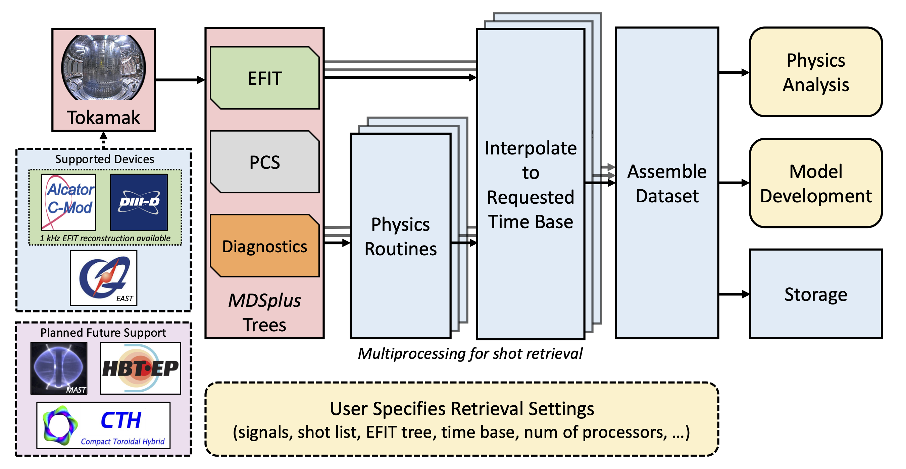

# DisruptionPy

#### An open-source physics-based Scientific Framework for Disruption Analysis of Fusion Plasmas for AI/ML applications

[](https://github.com/MIT-PSFC/disruption-py/actions/workflows/lint.yml)
[](https://github.com/MIT-PSFC/disruption-py/actions/workflows/tests.yml)
[](https://github.com/MIT-PSFC/disruption-py/actions/workflows/build.yml)
[](https://github.com/MIT-PSFC/disruption-py/actions/workflows/docs.yml)
[](https://github.com/MIT-PSFC/disruption-py/actions/workflows/dependabot/dependabot-updates)
[](https://github.com/MIT-PSFC/disruption-py/actions/workflows/stale.yml)

[](https://github.com/psf/black)
[](https://github.com/pylint-dev/pylint)
[](https://github.com/astral-sh/ruff)
[](https://github.com/koalaman/shellcheck)
[](https://github.com/adrienverge/yamllint)
[](https://github.com/pylint-dev/pylint-pytest)

[](pyproject.toml)
[](https://pepy.tech/project/disruption-py)
[](https://pypi.org/project/disruption-py/)
[](https://doi.org/10.5281/zenodo.13935223)
[](LICENSE)

## Concept

DisruptionPy is an open-source Scientific Python package for fast retrieval of experimental Fusion data from [MDSplus](https://www.mdsplus.org/) servers.
The library allows an efficient database preparation for downstream analysis and/or ML model development for disruption studies.
At present, the main supported machines are [Alcator C-Mod](https://en.wikipedia.org/wiki/Alcator_C-Mod) and [DIII-D](https://en.wikipedia.org/wiki/DIII-D_(tokamak)).


## Overview

### Background

A key element to ensure steady state operations in magnetically confined tokamak devices is the prediction and avoidance of disruptions.
These are sudden losses of the thermal and magnetic energy stored within the plasma, which can occur when tokamaks operate near stability boundaries or because of hardware anomalies.
The energy stored in the plasma and released during disruptions over milliseconds can cause severe damage to plasma-facing components, limiting experimental operations and the device's lifespan [[1](https://doi.org/10.1080/15361055.2023.2229675)].
Disruptions still pose a serious challenge to next-generation fusion devices such as ITER or SPARC, which will have to operate near some of the limits of plasma stability to achieve intended performance and will do so at for long and frequent intervals.
Fusion science currently lacks first-principle, theoretical solutions to fully predict and avoid disruptions.
However, previous work [[2](https://doi.org/10.1088/1741-4326/ab28bf), [3](https://doi.org/10.1088/1741-4326/abf74d)] has shown the usefulness of machine-learning (ML) algorithms for disruption prevention for both DIII-D and EAST -- the Experimental Advanced Superconducting Tokamak in China -- operations.
DisruptionPy provides a standardized analysis pipeline across different fusion devices to build ML-ready datasets.

### Workflow

DisruptionPy makes it easy to retrieve experimental data from [MDSplus](https://www.mdsplus.org/) fusion repositories efficiently.
Users can create their own routines and/or use built-in ones that retrieve and derive a variety of important signals from experimental data for disruption analysis.
These routines are then interpolated on a requested timebase across the specified set of plasma discharges (or shots) to assemble a dataset and save it under a variety of available formats.



_Figure: Schematic flowchart of a typical DisruptionPy workflow. By Y Wei (2024) [6]._

### Acknowledgments

The most recent revamp of DisruptionPy [4, 5, 6] was partially supported by DOE FES under Award DE-SC0024368, "Open and FAIR Fusion for Machine Learning Applications" [7].

### References

1. AD Maris, A Wang, C Rea, RS Granetz, E Marmar (2023), _"The Impact of Disruptions on the Economics of a Tokamak Power Plant"_, **Fusion Science and Technology** 80(5) 636-652, [DOI:10.1080/15361055.2023.2229675](https://doi.org/10.1080/15361055.2023.2229675).

2. C Rea, KJ Montes, KG Erickson, RS Granetz & RA Tinguely (2019), _"A real-time machine learning-based disruption predictor in DIII-D"_, **Nuclear Fusion** 59 096016, [DOI:10.1088/1741-4326/ab28bf](https://doi.org/10.1088/1741-4326/ab28bf).

3. WH Hu, C Rea, et al. (2021), _"Real-time prediction of high-density EAST disruptions using random forest"_, **Nuclear Fusion** 61 066034, [DOI:10.1088/1741-4326/abf74d](https://doi.org/10.1088/1741-4326/abf74d).

4. C Rea, et al. (2024), _"Open and FAIR Fusion for Machine Learning Applications"_, 66th APS Division of Plasma Physics Meeting, [PP12.27](https://meetings.aps.org/Meeting/DPP24/Session/PP12.27).

5. GL Trevisan, et al. (2024), _"Functional Improvements and Technical Developments of a Community-driven and Physics-informed Numerical Library for Disruption Studies"_, 66th APS Division of Plasma Physics Meeting, [PP12.9](https://meetings.aps.org/Meeting/DPP24/Session/PP12.9).

6. Y Wei, et al. (2024), _"Physics validation of parameter methods in DisruptionPy"_, 66th APS Division of Plasma Physics Meeting, [PP12.10](https://meetings.aps.org/Meeting/DPP24/Session/PP12.10).

7. C Rea, et al. (2023), _"Open and FAIR Fusion for Machine Learning Applications"_, [Project website](https://crea-psfc.github.io/open-fair-fusion/).


## Repository layout

Notable branches:

- `main`, the [stable branch](https://github.com/MIT-PSFC/disruption-py/tree/main),
- `dev`, the [development branch](https://github.com/MIT-PSFC/disruption-py/tree/dev),
- `matlab`, the [historical branch](https://github.com/MIT-PSFC/disruption-py/tree/matlab).


## Project layout

Brief description of the folders in our project:

- `disruption_py/`, package source code,
- `docs/`, documentation sources,
- `drafts/`, experimental scripts,
- `examples/`, example workflows,
- `scripts/`, miscellaneous scripts,
- `tests/`, testing workflows.


## Installation

DisruptionPy is now open-source and [available at PyPI](https://pypi.org/project/disruption-py/)!

For standard installations, please follow the usual way:

```bash
# if you use poetry:
poetry add disruption-py

# if you use pip:
pip install disruption-py
```

For custom installations, please refer to our [Installation guide](docs/INSTALL.md).


## Getting Started

Please see the [project quickstart](https://mit-psfc.github.io/disruption-py/quickstart/usage_quickstart/).


## Contributing

> [!IMPORTANT]
> Make sure you refer to the latest version of our [development branch](https://github.com/MIT-PSFC/disruption-py/tree/dev)!

- If you encounter any problems, please [create a new issue](https://github.com/MIT-PSFC/disruption-py/issues/new).
- If you would like to contribute, please [submit a pull request](https://github.com/MIT-PSFC/disruption-py/compare/dev...).
- If you have general questions, please [start a new discussion](https://github.com/MIT-PSFC/disruption-py/discussions/new?category=q-a).
